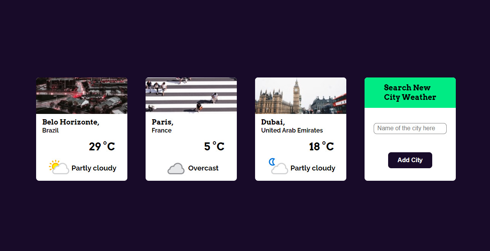

# Weather App

An app that allow a user to search the weather of a city around the world.

## Table of contents
- [General info](#general-info)
- [Objective](#objective)
- [Technologies](#technologies)
- [Setup](#setup)

## General info

The user can search the weather of a city around the globe in the search card. This weather is obtained from the Weather API. Besides that, the app also show a random image related to the city searched. This image is obtained from the Unsplash API. This data, composed by the weather information and the image, is displayed together in a card.

## Objective

Put in practice the concepts that I've learnt about React, JavaScript, APIs and web app hosting.

## Technologies

- CSS
- HTML
- JavaScript
- React
- Weather API
- Unsplash API
- Github
- Git
- Netlify

## Setup

To view the project, click [here](https://pam-weather-app.netlify.app/)

